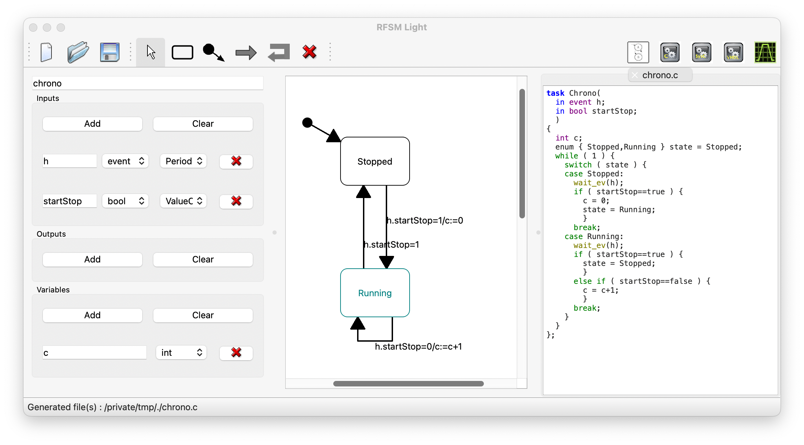
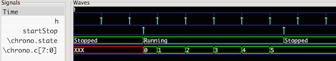

## Grasp 

**Grasp** is a tool for editing and simulating systems modeled as concurrent _reactive finite state
machines_.  A reactive state machine describes a behavior as a set of *states* connected by
*transitions* triggered by an *event* and a set of boolean *guards* and triggering a sequence of
*actions*. **Grasp** can also generate an implementation of the model (including a *testbench* for
testing it) in

    - `CTask` (a C dialect with primitives for describing event-based synchronisation)

    - `SystemC`

    - `VHDL` 

**Grasp** is actually a front-end to the [RFSM](https://github.com/jserot/rfsm) State Diagram
simulator and compiler. 

## DOCUMENTATION

A minimalistic "Howto" is available
[here](https://github.com/jserot/grasp/blob/master/doc/using.md)

This sequence of short videos can be used as a tutorial
1. [Tutorial part 1](https://github.com/jserot/grasp/releases/download/1.3.1/Light-v1.mov)
2. [Tutorial part 2](https://github.com/jserot/grasp/releases/download/1.3.1/Light-v2.mov)
3. [Tutorial part 3](https://github.com/jserot/grasp/releases/download/1.3.1/Light-v3.mov)
4. [Tutorial part 4](https://github.com/jserot/grasp/releases/download/1.3.1/Light-v4.mov)

## INSTALLATION

### Using binary versions

Prebuilt Windows and MacOS (Intel and M1) versions can be downloaded
[here](https://github.com/jserot/grasp/releases) (check the `Assets` tab).

For Windows, a quick Install Guide is available
[here](https://github.com/jserot/grasp/blob/master/dist/windows/windows-install-guide.pdf)

**Note** the [Graphviz](http://www.graphviz.org) package and the [gtkwave](http://gtkwave.sourceforge.net)
application (used, respectively, to display diagrams and viewing simulation results) are _not_
included in the distribution and must be installed separately. If you cannot (or don't want) to install
the `Graphviz` package, versions of **Grasp** using the [QGV](https://github.com/nbergont/qgv)
library instead are provided (the corresponding files have the `_qgv` suffix in the [corresponding
directory](https://github.com/jserot/grasp/releases). These versions are provided only as
workarounds because the rendering is poorer than when using the external `Graphviz` package. 

### Building from source 

See [this file](https://github.com/jserot/grasp/blob/master/BUILDING.md)
