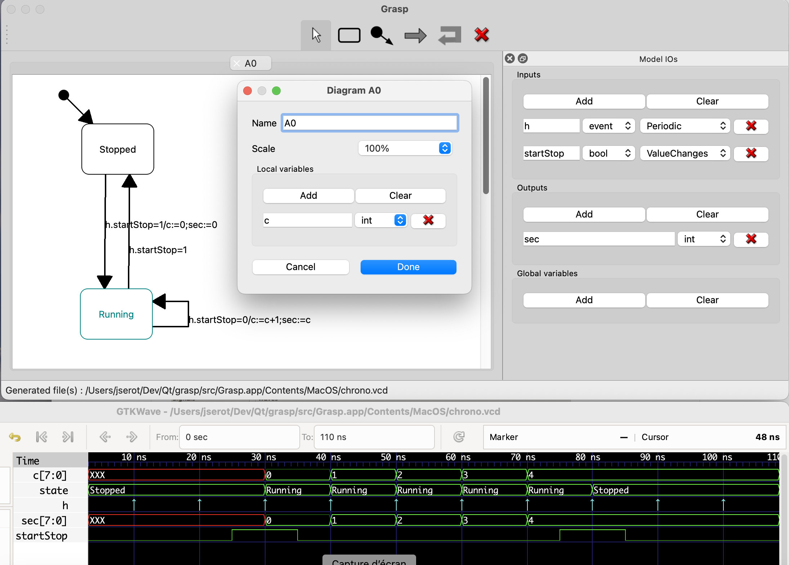

## Grasp 

**Grasp** (Graphical tool for designing for ReActive State machine-based Programs) is a tool for editing and
  simulating systems modeled as concurrent _reactive finite state machines_.  A reactive state
  machine describes a behavior as a set of _states_ connected by _transitions_ triggered by an
  _event_ and a set of boolean _guards_ and triggering a sequence of _actions_. **Grasp** can also
  generate an implementation of the model (including a _testbench_ for testing it) in

- `CTask` (a C dialect with primitives for describing event-based synchronisation)

- `SystemC`

- `VHDL`

**Grasp** is a descendant of [Rfsm-Light](https://github.com/jserot/rfsm-light), which was limited
to systems made of a single reactive state machine. Both are actually 
front-ends to the [RFSM](https://github.com/jserot/rfsm) State Diagram
simulator and compiler. 

## DOCUMENTATION

A minimalistic "Howto" is available
[here](https://github.com/jserot/grasp/blob/master/doc/Using.md)

Some video tutorials are available (sorry, in french for now)
- [Part 1 - editing and simulating a simple model](https://youtu.be/T0YVf1ipY5c)
- [Part 2 - editing and simulating multi-diagrams models](https://youtu.be/ZmJOC5WFAro)

## INSTALLATION

### Using pre-compiled versions

Ready-to-install versions are available for Linux (`.deb` package) and MacOS (`.dmg`)
[here](https://github.com/jserot/grasp/releases) (check the `Assets` tab).

A Windows version is in preparation. 

**Note** the [Graphviz](http://www.graphviz.org) package and the [gtkwave](http://gtkwave.sourceforge.net)
application (used, respectively, to display diagrams and viewing simulation results) are _not_
included in the distribution and must be installed separately. 

### Building from source 

See [this file](https://github.com/jserot/grasp/blob/master/BUILDING.md)
