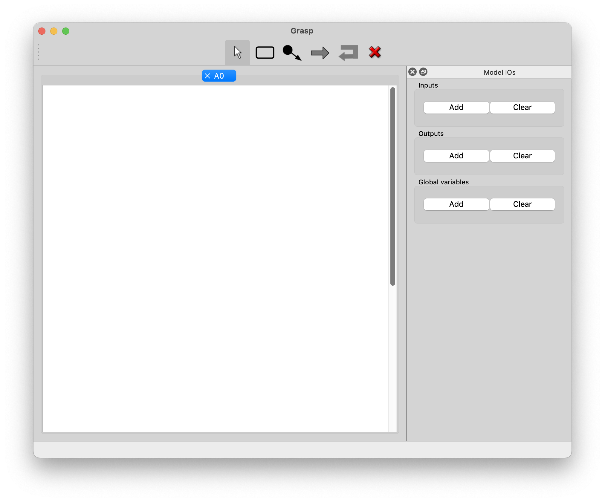
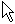
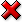
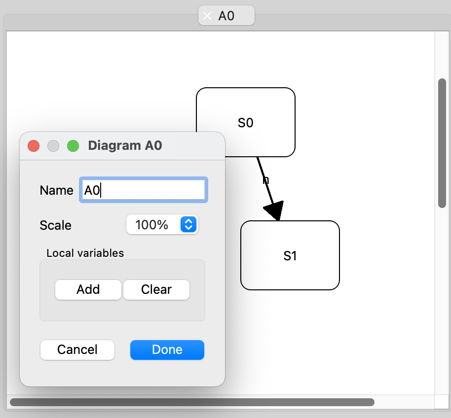

### Basic concepts

**Grasp** manipulates _models_. A _model_ is a collection of _diagrams_ with a set of global
_inputs_, _outputs_ and (shared) _variables_. I/Os and variables are typed. _Stimuli_ can be
attached to global inputs to perform simulations of the model. 

### Creating a model

After launching the application, invoke the `New model` action from the `File` menu. This creates a
new model, with a single diagram, and add two panels in the main window : one for editing this diagram
and another for editing the globals I/Os and variables of the model.

## Adding I/Os

Click the `Add` button in the `Model IOs` panel (this panel is _dockable_ window; it can be detached
from the main window if necessary and/or closed by (un)selecting the `Model IOs` item in the `View`
menu).

When adding an input, output or global (shared) variable, give its name and type. For inputs, it's possible
to also attach stimuli (but this is only required for simulating the model).

### Adding a state to a diagram 

Select the  button in the toolbar and click on the
  diagram editing panel. A pop-up dialog gives the opportunity to set the name of the added state and,
  possibly, to attach output valuations. Click `Done` when finished.

### Adding a transition to a diagram 

Select the  button, click on
  the start state and, keeping the mouse button pressed, go the end state and release mouse button.
  A popup dialog gives the opportunity to document the transition, by specifiying the triggering
  event and the associated guards and actions. Note that adding a transition requires that at least
  one input with type `event` has been attached to the model. As for states, click `Done` when
  finished. 

To add a **self transition** (from a state to itself) , select the  button
  and click on start state (the location of the click will decide on that of the transition).

To add an **initial transition**, select the  button, click near the
  initial state and, keeping the mouse button pressed, go the  initial state and release mouse
  button. A pop-up dialog gives the opportunity to add actions to the initial transition.
  Click `Done` when finished.

To **move a state**, select the  button and drag the state.

### Editing a state or a transition

Select the  button, and right-click (or Ctl-Click on a Mac) on the corresponding item 

### Deleting a state or a transition

select the  button
and click on the state or transition (deleting a state will also delete all incoming and
outcoming transitions)

### Changing the name of the diagram or add local variables

Right-click on the background of the corresponding panel.

### Adding / removing a diagram from a model

For adding a new diagram, invoke the `Add diagram` action from the `Model` menu. The name of 

Adding a diagram can also be performed by invoking the `Duplicate current diagram` action from the
`Model` menu. In this case, the added diagram is a copy the current one. A popup window gives the
opportunity the rename it accordingly. 

### Saving and loading

* Models can be saved to (resp. read from) files by invoking the `Save` or `Save as` (resp. `Open`)
  actions from the `File` menu. 
  
### Compiling

The `Compile` menu is used to generate various representations of the model and to simulate it. 

Compilation options can be adjusted, for each target representation, by invoking the `Compiler
options` action from the `Configuration` menu.

#### DOT

The `Generate DOT representation` action is used to produce a `.dot` representation, to be viewed by
the `Graphviz` set of tools. By default, this action generates a `.gif` image which is displayed in
a separate window. For this to work, the path to the `dot` program must have been correctly set in
the `Compiler paths` window accessible from the `Compiler and tools` action of the `Configuration`
menu.

It is also possible to view the `.dot` file using the `Graphviz` application. For this, select
the `-dot_external_viewer` option in the `General` tab of the `Compiler options` window accessible
from the `Configuration` menu. Again, for this to work, the path to the `graphviz` application must
have been correctly set in the `Compiler paths` window accessible from the `Compiler and tools`
action of the `Configuration` menu.

The`Generate DOT representation` generates a single file, in which the diagrams composing a model
are displayed as sub-graphs ("clusters"). It is sometimes useful to generate separates `.dot` files for
each diagram. For this, invoke the `Generate separate DOT representation` action. 

#### CTask, SystemC and VHDL

Invoke the corresponding action in the `Compile` menu. The generated code is produced in a separate
window. When multiple files are produced, these files are displayed in separate tabs. 

For `SystemC` and `VHDL`, the generated code may include or not a testbench for simulation.

#### RFSM

The `Generate RFSM code` generates the representation of the model for the
[rfsmc](https://github.com/jserot/rfsm) compiler. This representation is that used internally to
compile the model to other formats. It normally won't be used by the casual user.
  
### Simulating

Provided that stimuli have been attached to inputs in the `Model IOs` panel, 
the model can be simulated by invoking the `Run simulator` action of the `Compile` menu.

The generated `.vcd` file is the passed to the corresponding viewer application (as specified in the
`Compiler paths` window accessible from the `Compiler and tools` action from the `Configuration`
menu). 

### Trouble-shooting, debugging

When the `debug` option (in the `General` tab of the `Compiler
options` window accessible from the `Configuration` menu) is set, 
the application produces a log file (named `grasp.log`). This file can inspected to diagnose
problems. By default, this file is located in the working directory. 

Another possibility for debugging is  to launch the application from a command line interpreter
("console", "terminal", ...) so that log messages are produced directly on the standard output.
- under Windows
  - open a terminal (console, PowerShell, Cygwin, MSYS, ...)
  - cd to the directory where the `Grasp` application has been installed
  - launch it from the command line
- under MacOS / Linux
  - open a terminal (`Applications/Tools/Terminal.app` for MacOS)
  - cd to the directory where the `Grasp` application has been installed
  - launch it from the command line

The most common problems are due to wrong locations of the `dot` and `gtkwave` external tools
(used, respectively, to display to FSM diagrams and the simulation results). Check the paths
by choosing the `Compiler and Tools` in the `Configuration` menu. 
